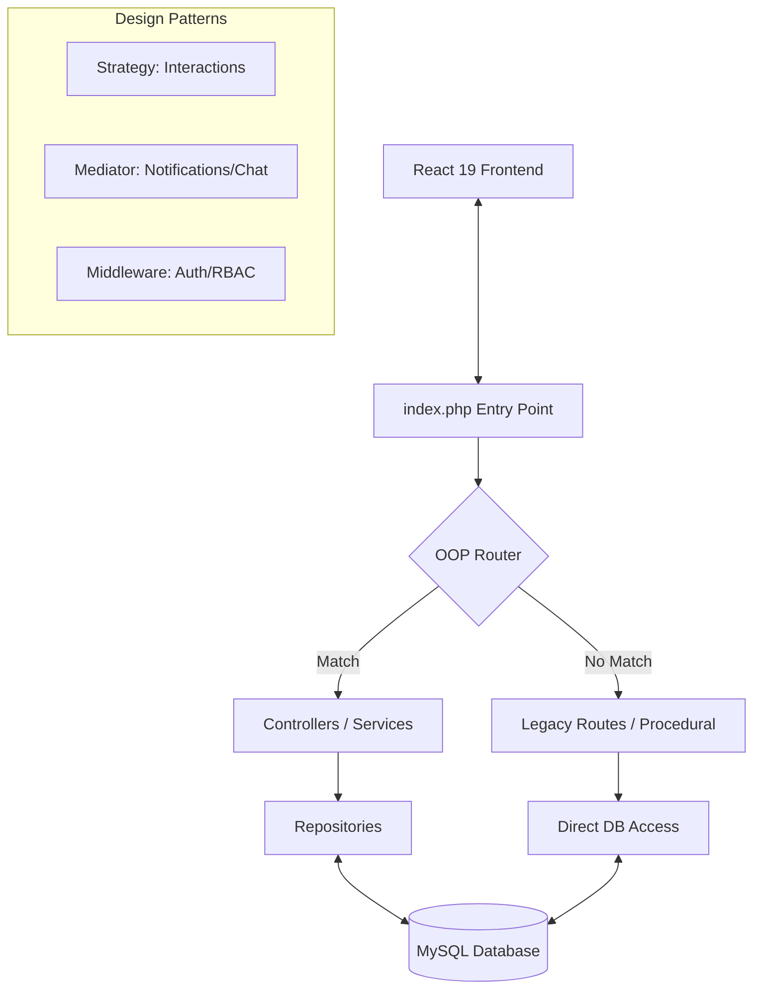

#  Uni-Link

> **The definitive social and academic hub for university students, professors, and administrators.**

Uni-Link is a modern, feature-rich university ecosystem designed to bridge the gap between social networking and academic management. Featuring a stunning 3D-enhanced UI, role-based interaction, and a powerful custom-built OOP backend, Uni-Link provides a seamless experience for the entire campus community.

---

## ✨ Features

### 🎓 For Students
-   **Dynamic Social Feed**: Share posts, media, and interact with the community using varied reactions (Like, Love, Celebrate, etc.).
-   **Skill Showcase**: Personalized profiles to highlight academic achievements, skills, and projects.
-   **Real-time Collaboration**: Private and project-specific chat rooms with @mentions and voice messaging support.
-   **Project Hub**: Upload, manage, and track progress on academic projects.
-   **Gamified Experience**: Earn tokens and climb the university leaderboard.

### 👨‍🏫 For Professors
-   **Advanced Analytics**: Track student performance and faculty distribution through intuitive dashboards.
-   **Project Management**: Review, grade, and provide detailed feedback on student submissions.
-   **Interaction Control**: Engage with student posts and manage specialized content.

### 🛠️ For Administrators
-   **Centralized Control**: Manage users (Students, Professors, Admins), faculties, and majors.
-   **System Oversight**: Real-time stats on university engagement and data integrity.
-   **Secure Management**: Granular role-based access control (RBAC).

---

## 🎨 Tech Stack

### Frontend
-   **Core**: [React 19](https://react.dev/) + [Vite](https://vitejs.dev/)
-   **Animations/3D**: [Three.js](https://threejs.org/), [React Three Fiber](https://r3f.docs.pmnd.rs/), [Framer Motion](https://www.framer.com/motion/), [GSAP](https://gsap.com/)
-   **Styling**: Vanilla CSS (Modern CSS features) + Tailwind CSS
-   **Charts**: [Chart.js](https://www.chartjs.org/)

### Backend
-   **Language**: PHP (7.4+ or 8.x)
-   **Architecture**: Custom OOP Framework with full backward compatibility.
-   **Design Patterns**: Strategy, Mediator, Repository, Singleton, Middleware.
-   **Database**: MySQL

---

## 🚀 Getting Started

### Prerequisites
-   **PHP** & **MySQL** (e.g., via XAMPP)
-   **Node.js** & **npm**

### Quick Installation

1.  **Clone the Repository**
    ```bash
    git clone https://github.com/youssefmohussein/Uni-Link.git
    cd Uni-Link
    ```

2.  **Backend Setup**
    -   Navigate to `/backend`
    -   Configure `.env` with your database credentials:
        ```env
        DB_HOST=localhost
        DB_NAME=unilink
        DB_USER=root
        DB_PASS=
        ```
    -   Start the PHP server: `php -S localhost:80`

3.  **Frontend Setup**
    -   Navigate to `/unilink`
    -   Install dependencies: `npm install`
    -   Start development server: `npm run dev`

4.  **Visit Uni-Link**: Open [http://localhost:5173](http://localhost:5173) in your browser.

---

## 🏗️ Architecture Visualization



---

## 📂 Project Structure

-   [`/unilink`](file:///c:/Develope%20Tools/Github/Uni-Link/unilink): React-based frontend application.
-   [`/backend`](file:///c:/Develope%20Tools/Github/Uni-Link/backend): Custom PHP backend framework.
    -   [`/app`](file:///c:/Develope%20Tools/Github/Uni-Link/backend/app): OOP Logic (Controllers, Models, Strategies).
    -   [`/config`](file:///c:/Develope%20Tools/Github/Uni-Link/backend/config): API Routes and Service definitions.
    -   [`/routes`](file:///c:/Develope%20Tools/Github/Uni-Link/backend/routes): Legacy procedural routes.

---

## 📄 License

This project is licensed under the MIT License - see the [LICENSE](file:///c:/Develope%20Tools/Github/Uni-Link/LICENSE) file for details.

---

Built with ❤️ by the Uni-Link Team.